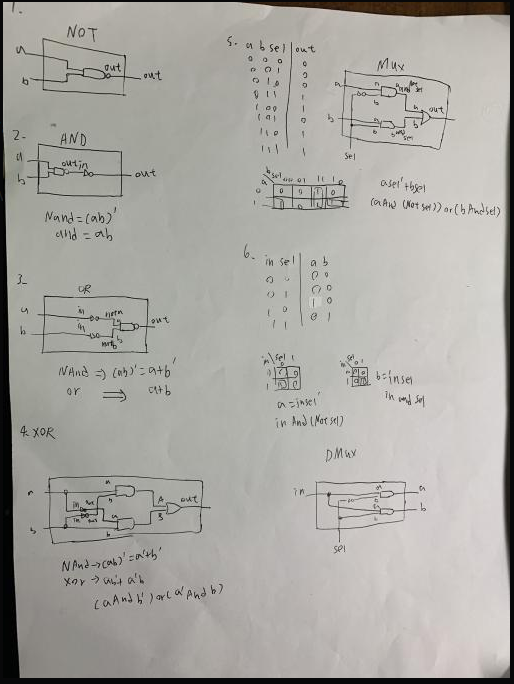

# HW

# NOT
<pre>
// This file is part of www.nand2tetris.org
// and the book "The Elements of Computing Systems"
// by Nisan and Schocken, MIT Press.
// File name: projects/01/Not.hdl

/**
 * Not gate:
 * out = not in
 */

CHIP Not {
    IN in;
    OUT out;

    PARTS:
    // Put your code here:
    Nand(a=in, b=in, out=out);
}
</pre>

# AND
<pre>
// This file is part of www.nand2tetris.org
// and the book "The Elements of Computing Systems"
// by Nisan and Schocken, MIT Press.
// File name: projects/01/And.hdl

/**
 * And gate: 
 * out = 1 if (a == 1 and b == 1)
 *       0 otherwise
 */

CHIP And {
    IN a, b;
    OUT out;

    PARTS:
    // Put your code here:
    Nand (a=a, b=b, out=anandb);
    Not (in=anandb, out=out);
}
</pre>
# OR
<pre>// This file is part of www.nand2tetris.org
// and the book "The Elements of Computing Systems"
// by Nisan and Schocken, MIT Press.
// File name: projects/01/Or.hdl

 /**
 * Or gate:
 * out = 1 if (a == 1 or b == 1)
 *       0 otherwise
 */

CHIP Or {
    IN a, b;
    OUT out;

    PARTS:
    // Put your code here:
    Not (in=a, out=nota);
    Not (in=b, out=notb);
    Nand (a=nota, b=notb, out=out);
}</pre>
# XOR
 <pre>// This file is part of www.nand2tetris.org
// and the book "The Elements of Computing Systems"
// by Nisan and Schocken, MIT Press.
// File name: projects/01/Xor.hdl

/**
 * Exclusive-or gate:
 * out = not (a == b)
 */

CHIP Xor {
    IN a, b;
    OUT out;

    PARTS:
    // Put your code here:
    Not (in=a, out=nota);
    Not (in=b, out=notb);
    And (a=a, b=notb, out=aandnotb);
    And (a=nota, b=b, out=notaandb);
    Or (a=aandnotb, b=notaandb, out=out);
}</pre>
# MUX
 <pre>// This file is part of www.nand2tetris.org
// and the book "The Elements of Computing Systems"
// by Nisan and Schocken, MIT Press.
// File name: projects/01/Mux.hdl

/** 
 * Multiplexor:
 * out = a if sel == 0
 *       b otherwise
 */

CHIP Mux {
    IN a, b, sel;
    OUT out;

    PARTS:
    // Put your code here:
    Not (in=sel, out=notsel);
    And (a=a, b=notsel, out=aandnotsel);
    And (a=b, b=sel, out=bandsel);
    Or (a=aandnotsel, b=bandsel, out=out);
}</pre>
# DMUX
<pre>// This file is part of www.nand2tetris.org
// and the book "The Elements of Computing Systems"
// by Nisan and Schocken, MIT Press.
// File name: projects/01/DMux.hdl

/**
 * Demultiplexor:
 * {a, b} = {in, 0} if sel == 0
 *          {0, in} if sel == 1
 */

CHIP DMux {
    IN in, sel;
    OUT a, b;

    PARTS:
    // Put your code here:
     Not (in=sel, out=notsel);
    And (a=in, b=notsel, out=a);
    And (a=in, b=sel, out=b);
}
</pre>

# 圖片
