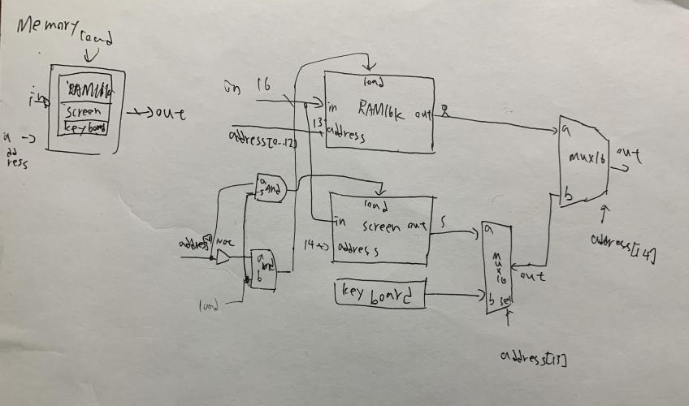

# hw 
## memmry

<pre>// This file is part of www.nand2tetris.org
// and the book "The Elements of Computing Systems"
// by Nisan and Schocken, MIT Press.
// File name: projects/05/CPU.hdl

/**
 * The Hack CPU (Central Processing unit), consisting of an ALU,
 * two registers named A and D, and a program counter named PC.
 * The CPU is designed to fetch and execute instructions written in 
 * the Hack machine language. In particular, functions as follows:
 * Executes the inputted instruction according to the Hack machine 
 * language specification. The D and A in the language specification
 * refer to CPU-resident registers, while M refers to the external
 * memory location addressed by A, i.e. to Memory[A]. The inM input 
 * holds the value of this location. If the current instruction needs 
 * to write a value to M, the value is placed in outM, the address 
 * of the target location is placed in the addressM output, and the 
 * writeM control bit is asserted. (When writeM==0, any value may 
 * appear in outM). The outM and writeM outputs are combinational: 
 * they are affected instantaneously by the execution of the current 
 * instruction. The addressM and pc outputs are clocked: although they 
 * are affected by the execution of the current instruction, they commit 
 * to their new values only in the next time step. If reset==1 then the 
 * CPU jumps to address 0 (i.e. pc is set to 0 in next time step) rather 
 * than to the address resulting from executing the current instruction. 
 */

CHIP CPU {

    IN  inM[16],         // M value input  (M = contents of RAM[A])
        instruction[16], // Instruction for execution
        reset;           // Signals whether to re-start the current
                         // program (reset==1) or continue executing
                         // the current program (reset==0).

    OUT outM[16],        // M value output
        writeM,          // Write to M? 
        addressM[15],    // Address in data memory (of M)
        pc[15];          // address of next instruction

    PARTS:
    // Put your code here:
    Not(in=address[14],out=Nad);
    And(a=address[14],b=load,out=Sload);
    And(a=Nad,b=load,out=Rload);

    RAM16K(in=in,address=address[0..13],load=Rload,out=R);
    Screen(in=in,address=address[0..12],load=Sload,out=S);
    Keyboard(out=kout);

    Mux16(a=S,b=kout,sel=address[13],out=outSk);
    Mux16(a=R,b=outSk,sel=address[14],out=out);
}</pre>

## 圖片
    
