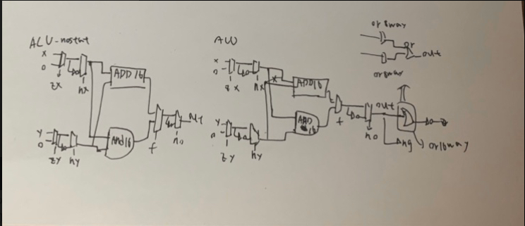

# HW
# ALU-nostat
<pre>CHIP ALU {
    IN  
        x[16], y[16],  // 16-bit inputs        
        zx, // zero the x input?
        nx, // negate the x input?
        zy, // zero the y input?
        ny, // negate the y input?
        f,  // compute out = x + y (if 1) or x & y (if 0)
        no; // negate the out output?

    OUT 
        out[16], // 16-bit output
        zr, // 1 if (out == 0), 0 otherwise
        ng; // 1 if (out < 0),  0 otherwise

    PARTS:
   // Put you code here:
    Mux16(a=x,b=false,sel=zx,out=x1);
    Mux16(a=y,b=false,sel=zy,out=y1);
    
    Not16(in=x1,out=nx1);
    Not16(in=y1,out=ny1);
    Mux16(a=x1,b=nx1,sel=nx,out=x2);
    Mux16(a=y1,b=ny1,sel=ny,out=y2);

    Add16(a=x2,b=y2,out=x2ady2);
    And16(a=x2,b=y2,out=x2any2);
    Mux16(a=x2any2,b=x2ady2,sel=f,out=fout);

    Not16(in=fout,out=nfout);
    Mux16(a=fout,b=nfout,sel=no,out=out);
}</pre>

# ALU
<pre>CHIP ALU {
    IN  
        x[16], y[16],  // 16-bit inputs        
        zx, // zero the x input?
        nx, // negate the x input?
        zy, // zero the y input?
        ny, // negate the y input?
        f,  // compute out = x + y (if 1) or x & y (if 0)
        no; // negate the out output?

    OUT 
        out[16], // 16-bit output
        zr, // 1 if (out == 0), 0 otherwise
        ng; // 1 if (out < 0),  0 otherwise

    PARTS:
   // Put you code here:
    Mux16(a=x, b=false, sel=zx, out=xZero);

    Not16(in=xZero, out=notZx);
    Mux16(a=xZero, b=notZx, sel=nx, out=MnotX);

    Mux16(a=y, b=false, sel=zy, out=yZero);

    Not16(in=yZero, out=notZy);
    Mux16(a=yZero, b=notZy, sel=ny, out=MnotY);

    And16(a=MnotY, b=MnotX, out=XandY);
    Add16(a=MnotY, b=MnotX, out=XaddY);
    Mux16(a=XandY, b=XaddY, sel=f, out=opr);

    Not16(in=opr, out=nOpr);
    Mux16(a=opr, b=nOpr, sel=no, out=out, out[0..7]=out07, out[8..15]=out815, out[15]=ng); 
    
    Or8Way(in=out07, out=or07);
    Or8Way(in=out815, out=or815);
    Or(a=or07, b=or815, out=or015);
    Not(in=or015, out=zr);
}</pre>

# 圖片
